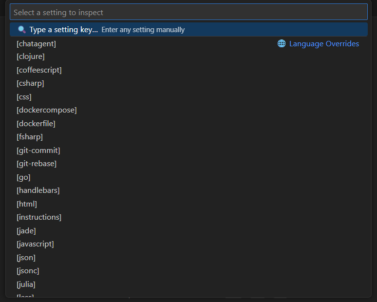
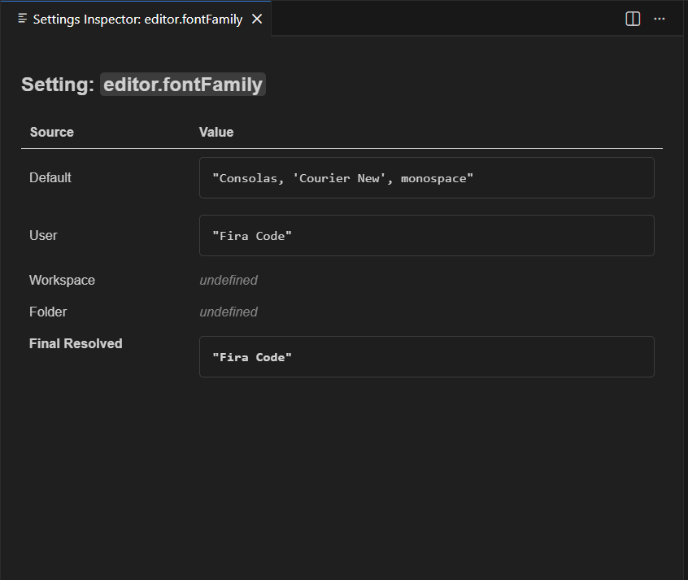
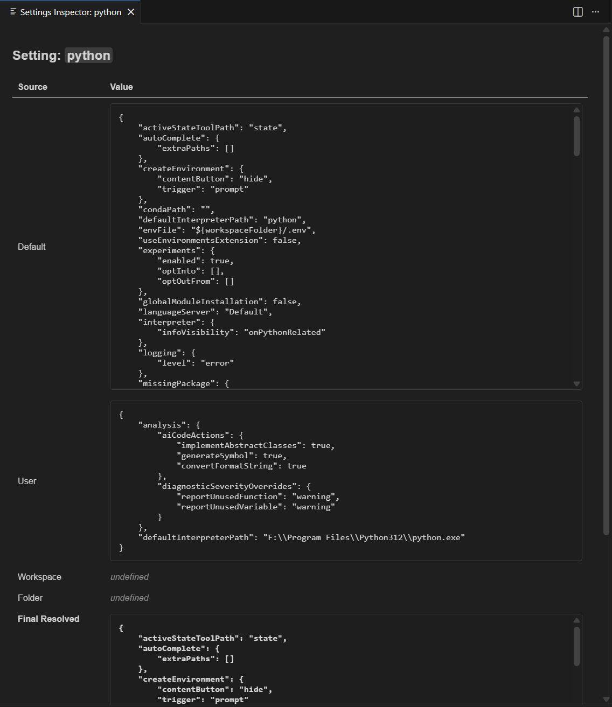

# Settings Inspector

A minimal, truthful VS Code extension that reveals the real resolved values of any setting.

VS Code often shows misleading or incomplete information about where a setting comes from.  
**Settings Inspector** displays the actual values from all scopes:

- Default  
- User  
- Workspace  
- Workspace Folder  
- Final Resolved  

It also categorizes settings into:

- **Language Overrides** (e.g. `[python]`)  
- **Built‑in Settings**  
- **Extension Settings`**  

and allows manual input for any setting key.

---

## Features

- Inspect any VS Code setting  
- View all scope values side‑by‑side  
- Pretty‑printed JSON for complex settings  
- Categorized dropdown:
  - Language Overrides  
  - Built‑in Settings  
  - Extension Settings  
- Manual input for arbitrary keys  
- Clean, minimal Webview UI  
- Works with large configuration trees (e.g. Python extension)

---

## Usage

1. Open the Command Palette  
2. Run: **Settings Inspector: Inspect Setting**  
3. Choose a setting from the categorized list  
   or select **Type a setting key…** to enter one manually  
4. A Webview panel opens showing all scope values and the final resolved value  

---

## Screenshots

### Command Palette & Categorized Dropdown

### Inspecting a simple setting

### Inspecting a complex setting

---

## Why this extension exists

VS Code’s Settings UI often hides the truth:

- It shows only the *effective* value  
- It doesn’t reveal which scope wins  
- It doesn’t show language‑specific overrides  
- It doesn’t expose extension defaults clearly  

**Settings Inspector** fixes that.

---

## Requirements

No dependencies.  
Works on any VS Code installation.

---

## Extension Settings

This extension contributes no settings.

---

## Known Issues

None at the moment.  
If you find something unexpected, please open an issue.

---

## Release Notes

### 0.0.1
- Initial release